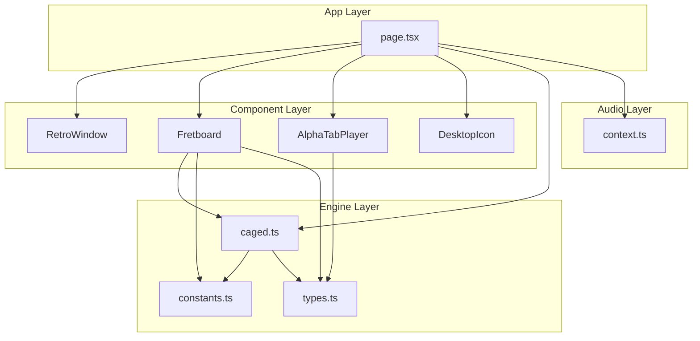

# Guitar Architect — Complete Product Requirements Document

**Version:** 3.3  
**Date:** 2026-01-22  
**Status:** Commercial Development Ready  
**Document Type:** OpenSpec / PRD Hybrid  

---

## Table of Contents

1. [Executive Summary](#1-executive-summary)
2. [Product Vision & Goals](#2-product-vision--goals)
3. [User Personas & Use Cases](#3-user-personas--use-cases)
4. [Information Architecture](#4-information-architecture)
5. [System Architecture](#5-system-architecture)
6. [Feature Specifications](#6-feature-specifications)
7. [Fretboard Engine & Mathematics](#7-fretboard-engine--mathematics)
8. [AlphaTab Integration](#8-alphatab-integration)
9. [Audio Engine](#9-audio-engine)
10. [UX/UI Design System](#10-uxui-design-system)
11. [Data Models & Type Definitions](#11-data-models--type-definitions)
12. [API & Component Contracts](#12-api--component-contracts)
13. [Security & Performance](#13-security--performance)
14. [Deployment & Infrastructure](#14-deployment--infrastructure)
15. [Testing Strategy](#15-testing-strategy)
16. [Roadmap & Future Enhancements](#16-roadmap--future-enhancements)
17. [Appendices](#17-appendices)

---

# 1. Executive Summary

## 1.1 Product Overview

**Guitar Architect** is a professional-grade web application designed for guitarists to visualize, learn, and practice music theory concepts through an interactive fretboard interface. The application bridges the gap between abstract music theory and physical guitar technique by providing multiple visualization modes, tab import capabilities, and a custom editing canvas.

## 1.2 Core Value Proposition

| Value Driver | Description |
|-------------|-------------|
| **Visual Learning** | Interactive fretboard renders chord shapes, scales, and arpeggios in real-time |
| **CAGED System Integration** | First-class support for the CAGED system with shape-aware navigation |
| **Tab Import** | Load Guitar Pro files and visualize them on the fretboard with bar-range constraints |
| **Seamless Editing** | Transition from theory mode to custom editing without friction |
| **Export & Share** | Generate high-quality PDF exports of custom fingerings |

## 1.3 Key Differentiators

1. **Dual-State Architecture**: Clean separation between "Generator" (theory-driven) and "Editor" (canvas-driven) modes
2. **Neo-Soul Waterfall Pattern**: Unique visualization for the 2-1-2 diagonal arpeggio pattern
3. **Retro OS Aesthetic**: Distinctive Windows 95-inspired UI creating memorable brand identity
4. **AlphaTab Integration**: Professional-grade tab rendering with synchronized fretboard visualization

---

# 2. Product Vision & Goals

## 2.1 Vision Statement

*"To be the definitive digital tool for guitarists who want to understand and visualize music theory on the fretboard, bridging the gap between knowing a concept and playing it."*

## 2.2 Strategic Goals

| Goal | Metric | Target |
|------|--------|--------|
| **User Adoption** | Monthly Active Users | 50,000 in Year 1 |
| **Engagement** | Average Session Duration | > 15 minutes |
| **Conversion** | Free → Pro Upgrade Rate | 8% |
| **Retention** | 30-Day Retention | > 40% |

## 2.3 Product Principles

1. **Theory Made Tangible**: Every abstract concept maps to a visual representation
2. **Minimal Friction**: One-click transitions between modes
3. **Professional Output**: Exports suitable for teaching materials and sheet music
4. **Performance First**: 60fps rendering regardless of fretboard complexity

## 2.4 Commercialization Strategy

### 2.4.1 Monetization Model

| Tier | Price | Target User |
|------|-------|-------------|
| **Free** | $0 | Casual learners, discovery phase |
| **Pro Monthly** | $9.99/mo | Serious hobbyists, students |
| **Pro Annual** | $79.99/yr (~$6.67/mo) | Committed learners (best value) |
| **Lifetime** | $199 (limited availability) | Early adopters, power users |

### 2.4.2 Free vs Pro Feature Matrix

| Feature | Free | Pro |
|---------|:----:|:---:|
| **Fretboard Visualizer** | ✅ Full access | ✅ |
| **CAGED Shapes (5 shapes)** | ✅ All shapes | ✅ |
| **Visualization Modes** | ✅ Box + Horizontal | ✅ |
| **Root Selection** | ✅ All 12 roots | ✅ |
| **Basic Arpeggios** | ✅ Maj7, Dom7, Min7, Min7b5, Dim7 | ✅ |
| **Extended Arpeggios** | ❌ | ✅ 9ths, 11ths, 13ths, Altered |
| **Basic Scales** | ✅ Major scale (Ionian) | ✅ |
| **All Scales & Modes** | ❌ | ✅ All 7 modes, Harmonic/Melodic minor |
| **Pentatonic & Blues** | ⚠️ Minor Pentatonic only | ✅ Major Pent, Blues Scale |
| **Edit Mode** | ⚠️ Limited to 8 notes | ✅ Unlimited |
| **Tab Import** | ⚠️ **1 file total** (upgrade to unlock more) | ✅ Unlimited files |
| **Tab Bar Limit** | ⚠️ First 16 bars only | ✅ Full song access |
| **Playback Controls** | ⚠️ Play/Pause only | ✅ Speed, Loop, Metronome, Count-in |
| **Note Selection in Tabs** | ❌ | ✅ Click-to-select notes |
| **PDF Export** | ⚠️ Watermarked | ✅ Clean export |
| **Alternative Tunings** | ⚠️ Standard only | ✅ DADGAD, Drop D, Open D, Custom |
| **Cloud Save** | ❌ | ✅ Sync across devices |
| **Practice Statistics** | ❌ | ✅ Track progress |
| **Offline Mode (PWA)** | ❌ | ✅ Download for offline |

### 2.4.3 Preset Bank Architecture

The application features a comprehensive **Preset Bank** organized into three main categories. All presets can be visualized in either **Box Mode** (CAGED position-based) or **Horizontal Mode** (linear across the neck).

#### Visualization Modes

| Mode | Description | Use Case |
|------|-------------|----------|
| **Box Mode** | Notes confined within a single CAGED position (4-5 fret span) | Learning shapes, position playing |
| **Horizontal Mode** | Notes displayed linearly across the entire fretboard | Seeing patterns, connecting positions |

#### Category 1: Arpeggios

| Subcategory | Presets | Tier |
|-------------|---------|------|
| **7th Chords** | Maj7, Dom7, Min7, Min7b5, Dim7 | Free |
| **9th Chords** | Maj9, Dom9, Min9, 9sus4 | Pro |
| **11th Chords** | Maj11, Dom11, Min11 | Pro |
| **13th Chords** | Maj13, Dom13, Min13 | Pro |
| **Altered** | Dom7#5, Dom7b5, Dom7#9, Dom7b9, Alt (7#5#9) | Pro |
| **Add Chords** | Add9, Add11, 6/9 | Pro |
| **Sus Chords** | Sus2, Sus4, 7sus2, 7sus4 | Pro |

#### Category 2: Scales

| Subcategory | Presets | Tier |
|-------------|---------|------|
| **Diatonic Modes** | Ionian (Major), Dorian, Phrygian, Lydian, Mixolydian, Aeolian (Minor), Locrian | Free: Ionian only, Pro: All 7 |
| **Harmonic Minor Modes** | Harmonic Minor, Locrian ♮6, Ionian #5, Dorian #4, Phrygian Dominant, Lydian #2, Super Locrian bb7 | Pro |
| **Melodic Minor Modes** | Melodic Minor, Dorian b2, Lydian Augmented, Lydian Dominant, Mixolydian b6, Locrian ♮2, Altered | Pro |
| **Pentatonic** | Major Pentatonic, Minor Pentatonic | Free: Minor Pent, Pro: Major Pent |
| **Blues** | Blues Scale (6-note), Blues Scale + Major 3rd | Pro |
| **Symmetric** | Whole Tone, Diminished (HW), Diminished (WH), Chromatic | Pro |
| **Exotic** | Hungarian Minor, Phrygian Dominant, Japanese (In-Sen), Hirajoshi | Pro |

#### Category 3: Chord Voicings (Future)

| Subcategory | Description | Tier |
|-------------|-------------|------|
| **Drop 2** | Common jazz voicings | Pro |
| **Drop 3** | Extended range voicings | Pro |
| **Shell Voicings** | 3-note essential voicings | Pro |
| **Triads** | Inversions across string sets | Free basic, Pro all inversions |

### 2.4.4 Conversion Touchpoints

| Trigger | Message | Intent Level |
|---------|---------|--------------|
| 2nd tab import attempt | "You've used your free import. Upgrade to Pro for unlimited tabs." | High |
| Try alternative tuning | "Drop D is a Pro feature. Unlock all tunings with Pro." | Moderate |
| Select extended arpeggio (9th, 11th, etc.) | "Extended arpeggios are a Pro feature. Upgrade to unlock!" | High |
| Select non-Ionian mode | "Dorian mode is a Pro feature. Unlock all 7 modes with Pro." | High |
| Export PDF | "Your export will include a watermark. Go Pro for clean exports." | High |
| 9+ notes in Edit mode | "Free tier supports 8 notes. Go Pro for unlimited." | Moderate |
| Try speed/loop control | "Practice controls are a Pro feature. Perfect for learning!" | High |
| After 7 days of return visits | "You're getting serious! Here's 20% off your first year." | High |
| Select notes in Tab mode | "Note selection is a Pro feature. Upgrade to filter exactly what you practice." | High |

---

# 3. User Personas & Use Cases

## 3.1 Primary Personas

### Persona A: The Intermediate Guitarist ("Alex")

| Attribute | Description |
|-----------|-------------|
| **Age** | 22-35 |
| **Skill Level** | 2-5 years playing |
| **Goals** | Understand CAGED system, improvise over chord changes |
| **Pain Points** | Memorizing shapes across the neck, connecting positions |
| **Usage Pattern** | 3-4 sessions/week, 20-30 minutes each |

### Persona B: The Music Teacher ("Maria")

| Attribute | Description |
|-----------|-------------|
| **Age** | 30-50 |
| **Skill Level** | Professional |
| **Goals** | Create lesson materials, demonstrate concepts to students |
| **Pain Points** | Time-consuming to create custom diagrams |
| **Usage Pattern** | Pre-lesson prep, in-lesson demonstration |

### Persona C: The Neo-Soul Enthusiast ("Jordan")

| Attribute | Description |
|-----------|-------------|
| **Age** | 18-30 |
| **Skill Level** | Intermediate-Advanced |
| **Goals** | Master R&B/Neo-Soul chord voicings and runs |
| **Pain Points** | Finding resources specific to Neo-Soul guitar technique |
| **Usage Pattern** | Practice sessions focused on specific progressions |

## 3.2 Use Case Catalog

| ID | Use Case | Primary Actor | Preconditions | Flow |
|----|----------|---------------|---------------|------|
| UC-01 | Visualize Chord Shape | Alex | App loaded | Select Root → Select Quality → Select Shape → View fretboard |
| UC-02 | Cycle Through Shapes | Alex | Chord displayed | Double-click root note → View next CAGED shape |
| UC-03 | Import Tab File | Jordan | Has .gp file | Click Tab_Importer → Upload file → View score + fretboard |
| UC-04 | Create Custom Diagram | Maria | None | Enter Edit mode → Click to add notes → Export PDF |
| UC-05 | Practice Waterfall Pattern | Jordan | Chord displayed | Switch to Waterfall mode → View diagonal pattern |
| UC-06 | Constrain Bar Range | Any | Tab loaded | Set Start/End bar → View filtered notation |

---

# 4. Information Architecture

## 4.1 Screen Architecture Overview

The application consists of **7 core screens** organized around a retro OS desktop metaphor.

### Screen Inventory

| # | Screen | Purpose | Access Level |
|---|--------|---------|--------------|
| 1 | **Landing / Onboarding** | First impression, value prop, signup CTA | All |
| 2 | **Desktop (Main Canvas)** | OS-style workspace with app icons | All |
| 3 | **Fretboard Studio** | CAGED visualization (Box, Waterfall, Edit) | All |
| 4 | **Tab Player** | Score + Tab + Fretboard sync | Free: Limited, Pro: Full |
| 5 | **Library / My Sessions** | Saved diagrams, imported tabs, history | Registered |
| 6 | **Settings / Account** | Preferences, subscription, profile | Registered |
| 7 | **Upgrade Modal** | Conversion touchpoint at gates | Free users |

### Screen Map Diagram

```
┌─────────────────────────────────────────────────────────────────────────────┐
│                              SCREEN MAP                                      │
├─────────────────────────────────────────────────────────────────────────────┤
│                                                                              │
│  ┌─────────────────────────────────────────────────────────────────────┐    │
│  │  1. LANDING / ONBOARDING                                             │    │
│  │     • Hero with animated fretboard demo                              │    │
│  │     • "Try it Free" CTA (no signup required)                         │    │
│  │     • Social proof, testimonials                                     │    │
│  │     • Sign in / Create account links                                 │    │
│  └───────────────────────────────┬─────────────────────────────────────┘    │
│                                  │                                           │
│                                  ▼                                           │
│  ┌─────────────────────────────────────────────────────────────────────┐    │
│  │  2. DESKTOP (Main Canvas)                                            │    │
│  │     ┌──────────┐  ┌──────────┐  ┌──────────┐  ┌──────────┐          │    │
│  │     │Active    │  │Tab       │  │Export    │  │Library   │          │    │
│  │     │Session   │  │Importer  │  │PDF       │  │          │          │    │
│  │     │.exe      │  │.exe      │  │.exe      │  │.exe      │          │    │
│  │     └────┬─────┘  └────┬─────┘  └────┬─────┘  └────┬─────┘          │    │
│  │          │             │             │             │                 │    │
│  └──────────┼─────────────┼─────────────┼─────────────┼─────────────────┘    │
│             │             │             │             │                      │
│             ▼             ▼             ▼             ▼                      │
│  ┌──────────────┐ ┌──────────────┐ ┌──────────┐ ┌──────────────┐            │
│  │3. FRETBOARD  │ │4. TAB PLAYER │ │ Download │ │5. LIBRARY    │            │
│  │   STUDIO     │ │              │ │   PDF    │ │              │            │
│  └──────────────┘ └──────────────┘ └──────────┘ └──────────────┘            │
│                                                                              │
│  ┌──────────────────────────────────────────────────────────────────────┐   │
│  │  6. SETTINGS / ACCOUNT (Accessible via menu/icon)                    │   │
│  └──────────────────────────────────────────────────────────────────────┘   │
│                                                                              │
│  ┌──────────────────────────────────────────────────────────────────────┐   │
│  │  7. UPGRADE MODAL (Appears at conversion gates)                      │   │
│  └──────────────────────────────────────────────────────────────────────┘   │
│                                                                              │
└─────────────────────────────────────────────────────────────────────────────┘
```

## 4.2 Detailed Screen Specifications

### Screen 1: Landing / Onboarding

```
┌─────────────────────────────────────────────────────────────────────────────┐
│                                                                              │
│     🎸 GUITAR ARCHITECT                                     [Sign In]       │
│     ─────────────────────────────────────────────────────────────────       │
│                                                                              │
│     "See the fretboard. Finally."                                           │
│                                                                              │
│     ┌───────────────────────────────────────────────────────────────┐       │
│     │                                                               │       │
│     │     [Animated Hero: Fretboard with CAGED shape cycling]      │       │
│     │                                                               │       │
│     └───────────────────────────────────────────────────────────────┘       │
│                                                                              │
│     ┌─────────────────────────────────────────────────────────┐             │
│     │        ▶ Try it Free — No signup required                │             │
│     └─────────────────────────────────────────────────────────┘             │
│                                                                              │
│     ─────────────────────────────────────────────────────────────────       │
│     "Finally clicked for me" - @guitarist_mike                              │
│     ⭐⭐⭐⭐⭐ 4.9 from 2,400 reviews                                        │
│                                                                              │
│     [Features] [Pricing] [About]                                            │
│                                                                              │
└─────────────────────────────────────────────────────────────────────────────┘
```

### Screen 2: Desktop (Main Canvas)

```
┌─────────────────────────────────────────────────────────────────────────────┐
│  Guitar Architect v27                                    [_][□][X]          │
├─────────────────────────────────────────────────────────────────────────────┤
│                                                                              │
│     ┌──────────┐    ┌──────────┐    ┌──────────┐    ┌──────────┐           │
│     │   📁     │    │   📄     │    │   📤     │    │   📚     │           │
│     │          │    │          │    │          │    │          │           │
│     │Active    │    │Tab       │    │Export    │    │Library   │           │
│     │Session   │    │Importer  │    │PDF       │    │          │           │
│     └──────────┘    └──────────┘    └──────────┘    └──────────┘           │
│                                                                              │
│     ┌──────────┐                                                            │
│     │   ⚙️     │                                                            │
│     │          │                                                            │
│     │Settings  │                                                            │
│     └──────────┘                                                            │
│                                                                              │
│  ─────────────────────────────────────────────────────────────────────────  │
│  [Taskbar]                              [User: Guest ▼]  [🔔]  [12:00 AM]   │
└─────────────────────────────────────────────────────────────────────────────┘
```

### Screen 3: Fretboard Studio

```
┌─────────────────────────────────────────────────────────────────────────────┐
│  Active_Session.exe                                     [_][□][X]           │
├─────────────────────────────────────────────────────────────────────────────┤
│  CONTROL PANEL                                                               │
│  ┌──────────┐ ┌──────────┐ ┌──────────┐ ┌──────────┐ ┌──────────┐          │
│  │Root: C ▼ │ │Qual:Maj7▼│ │Shape: E▼ │ │Mode: Box▼│ │Tuning:Std│          │
│  └──────────┘ └──────────┘ └──────────┘ └──────────┘ └──────────┘          │
│                                                                              │
│  ┌──────────────────────────────────────────────────────────────────────┐  │
│  │                                                                       │  │
│  │  FRETBOARD VISUALIZER (24 frets)                                     │  │
│  │  ┌─────────────────────────────────────────────────────────────────┐ │  │
│  │  │ 0   1   2   3   4   5   6   7   8   9  10  11  12 ... 24       │ │  │
│  │  │ ●───────────●───────────────────────────────────────────────── │ │  │
│  │  │ ────────────────●───────────────────────────────────────────── │ │  │
│  │  │ ────────────────────●───────────────────────────────────────── │ │  │
│  │  │ ────────────────────────●───────────────────────────────────── │ │  │
│  │  │ ────────────────●───────────────────────────────────────────── │ │  │
│  │  │ ●───────────●───────────────────────────────────────────────── │ │  │
│  │  └─────────────────────────────────────────────────────────────────┘ │  │
│  │                                                                       │  │
│  └──────────────────────────────────────────────────────────────────────┘  │
│                                                                              │
│  [CAGED Selector: C  A  G  E  D]    Legend: ● Root  ○ Chord Tone           │
└─────────────────────────────────────────────────────────────────────────────┘
```

### Screen 4: Tab Player (Split View)

Reference design concept:


```
┌─────────────────────────────────────────────────────────────────────────────┐
│  Tab_Viewer.exe                                         [_][□][X]           │
├─────────────────────────────────────────────────────────────────────────────┤
│  PLAYBACK CONTROLS                                                           │
│  ┌────────────────────────────────────────────────────────────────────────┐ │
│  │ [⏮][⏪][▶/⏸][⏹][⏩][⏭] │ 🔁Loop │ ♩Metro │ BPM:[120▼] │ 🔊████░░ │ │
│  │                          │        │        │             │           │ │
│  │ [◀ PREV] [NEXT ▶]  Window:[2▼]  │  Bars: [1]-[2] / 120  │ Track:[1▼]│ │
│  └────────────────────────────────────────────────────────────────────────┘ │
│                                                                              │
│  SCORE + TAB (Top 50%) ─────────────────────────────────────────────────── │
│  ┌────────────────────────────────────────────────────────────────────────┐ │
│  │  ♩ ♪ ♫ ♬   (Standard Notation with clickable notes)                   │ │
│  │  ─────────────────────────────────────────────────────────────────── │ │
│  │  T  10─13──12────  (Tablature)                                        │ │
│  │  A  11────11─────                                                     │ │
│  │  B  ─────────12──                                                     │ │
│  │                                                                        │ │
│  │  💡 Pro Tip: Click notes on the score to select them for fretboard   │ │
│  └────────────────────────────────────────────────────────────────────────┘ │
│                                                                              │
│  FRETBOARD SYNC (Bottom 50%) ───────────────────────────────────────────── │
│  ┌────────────────────────────────────────────────────────────────────────┐ │
│  │                                                                        │ │
│  │  [Fretboard showing only notes from visible/selected bars]            │ │
│  │                                                                        │ │
│  └────────────────────────────────────────────────────────────────────────┘ │
└─────────────────────────────────────────────────────────────────────────────┘
```

### Screen 5: Library / My Sessions

```
┌─────────────────────────────────────────────────────────────────────────────┐
│  Library.exe                                            [_][□][X]           │
├─────────────────────────────────────────────────────────────────────────────┤
│                                                                              │
│  MY SAVED SESSIONS                                    [+ New Session]       │
│  ─────────────────────────────────────────────────────────────────────────  │
│                                                                              │
│  ┌─────────────────────────────────────────────────────────────────────┐   │
│  │ 📁 CMaj7 - E Shape Practice           Last edited: 2 hours ago     │   │
│  │ 📁 Neo-Soul Waterfall - Gm7           Last edited: Yesterday       │   │
│  │ 📁 Custom Voicing - Dm9               Last edited: 3 days ago      │   │
│  └─────────────────────────────────────────────────────────────────────┘   │
│                                                                              │
│  IMPORTED TABS                                        [Upload New]          │
│  ─────────────────────────────────────────────────────────────────────────  │
│                                                                              │
│  ┌─────────────────────────────────────────────────────────────────────┐   │
│  │ 🎵 Pentatonic_Licks.gp                Imported: Jan 20             │   │
│  │    ⚠️ Free tier: Upgrade to import more tabs                        │   │
│  └─────────────────────────────────────────────────────────────────────┘   │
│                                                                              │
└─────────────────────────────────────────────────────────────────────────────┘
```

### Screen 6: Settings / Account

```
┌─────────────────────────────────────────────────────────────────────────────┐
│  Settings.exe                                           [_][□][X]           │
├─────────────────────────────────────────────────────────────────────────────┤
│                                                                              │
│  ACCOUNT                                                                     │
│  ─────────────────────                                                      │
│  Email: alex@example.com                                                    │
│  Plan: Free Tier                          [Upgrade to Pro →]                │
│                                                                              │
│  PREFERENCES                                                                 │
│  ─────────────────────                                                      │
│  Default Tuning: [Standard ▼]                                               │
│  Default Quality: [Maj7 ▼]                                                  │
│  Audio Feedback: [On ▼]                                                     │
│  Theme: [Classic (Win95) ▼]                                                 │
│                                                                              │
│  EXPORT                                                                      │
│  ─────────────────────                                                      │
│  PDF Quality: [High ▼]                                                      │
│  Include Watermark: ✅ (Free tier)                                          │
│                                                                              │
│  [Save Changes]                                                              │
│                                                                              │
└─────────────────────────────────────────────────────────────────────────────┘
```

### Screen 7: Upgrade Modal

```
┌─────────────────────────────────────────────────────────────────────────────┐
│                                                           [X]               │
│                                                                              │
│     🚀 UNLOCK YOUR FULL POTENTIAL                                           │
│     ─────────────────────────────────────────────────────────────────       │
│                                                                              │
│     You've used your free tab import.                                       │
│     Upgrade to Pro for unlimited access!                                    │
│                                                                              │
│     ✅ Unlimited tab imports                                                │
│     ✅ Full playback controls (speed, loop, metronome)                      │
│     ✅ All scales & modes (harmonic minor, all 8 diatonic modes)            │
│     ✅ Note selection in Tab mode                                           │
│     ✅ Alternative tunings                                                  │
│     ✅ Clean PDF exports (no watermark)                                     │
│     ✅ Cloud sync across devices                                            │
│                                                                              │
│     ┌─────────────────────────┐  ┌─────────────────────────┐               │
│     │   Monthly: $9.99/mo     │  │  Annual: $79.99/yr      │               │
│     │                         │  │  ⭐ Best Value (-33%)   │               │
│     │   [Start Free Trial]    │  │  [Start Free Trial]     │               │
│     └─────────────────────────┘  └─────────────────────────┘               │
│                                                                              │
│     [Maybe Later]                                                           │
│                                                                              │
└─────────────────────────────────────────────────────────────────────────────┘
```

## 4.3 First-Time User Experience (FTUX)

### Unregistered User Flow

```
Landing Page
     │
     │ "Try it Free"
     ▼
┌─────────────────────────────────────┐
│ Guided Tour Overlay (3 steps)       │
│ 1. Select a root note               │
│ 2. Choose a chord quality           │
│ 3. Double-click to cycle shapes     │
└───────────────────┬─────────────────┘
                    │
                    ▼
          Fretboard Studio
          (CMaj7 E-Shape preloaded)
                    │
                    │ After 2 min interaction
                    ▼
          Subtle banner: "Create a free account to save"
                    │
                    │ First gate hit (e.g., 2nd tab import)
                    ▼
          Upgrade Modal
```

### Registered User (Free Tier) - Return Visit

```
┌─────────────────────────────────────────────────────────────────────────────┐
│                                                                              │
│  👋 Welcome back, Alex                                                      │
│                                                                              │
│  ┌─────────────────────────────────────────────────────────────────────┐   │
│  │  CONTINUE WHERE YOU LEFT OFF                                        │   │
│  │  [CMaj7 E-Shape Practice]    Last: 2 hours ago    [Open]            │   │
│  └─────────────────────────────────────────────────────────────────────┘   │
│                                                                              │
│  ┌───────────────┐ ┌───────────────┐ ┌───────────────┐                     │
│  │ NEW SESSION   │ │ IMPORT TAB    │ │ MY LIBRARY    │                     │
│  │               │ │ (0/1 used)    │ │ (3 saved)     │                     │
│  └───────────────┘ └───────────────┘ └───────────────┘                     │
│                                                                              │
│  ─────────────────────────────────────────────────────────────────────────  │
│  🚀 TIP: Unlock all 8 modes of the major scale with Pro                    │
│  ─────────────────────────────────────────────────────────────────────────  │
│                                                                              │
└─────────────────────────────────────────────────────────────────────────────┘
```

## 4.4 Navigation Model

| Trigger | Current State | Target State | Transition Type |
|---------|---------------|--------------|-----------------|
| Click `Active_Session` icon | Desktop | Generator Window (Box mode) | Modal Open |
| Click `Tab_Importer` icon | Desktop | File Upload Dialog | Modal Open |
| Upload .gp file | File Dialog | Tab Mode (Split View) | Content Load |
| Click empty fret (Box/Waterfall) | Generator | Editor | State Change |
| Click `Edit` button | Any mode | Editor | State Change |
| Double-click root note | Box/Waterfall | Same Mode (New Shape) | State Change |
| Click `Export_PDF` icon | Any | PDF Download | Action |

## 4.3 State Machine

```
                                    ┌─────────────┐
                                    │   DESKTOP   │
                                    └──────┬──────┘
                                           │
                              ┌────────────┼────────────┐
                              ▼            ▼            ▼
                        ┌─────────┐  ┌─────────┐  ┌─────────┐
                        │   BOX   │  │   TAB   │  │  EDIT   │
                        └────┬────┘  └────┬────┘  └────┬────┘
                             │            │            │
              ┌──────────────┼────────────┼────────────┘
              │              │            │
              ▼              ▼            │
        ┌───────────┐  ┌───────────┐      │
        │ WATERFALL │  │  (Read    │      │
        └─────┬─────┘  │   Only)   │      │
              │        └───────────┘      │
              │                           │
              └───────────────────────────┘
                    (Click empty fret)

Legend:
  BOX → WATERFALL    : Mode toggle via UI
  BOX → EDIT         : Click empty fret OR Edit button
  TAB → EDIT         : Edit button (snapshots tab notes)
  WATERFALL → EDIT   : Click empty fret
  EDIT → BOX         : Click pattern mode button
```

---

# 5. System Architecture

## 5.1 Technology Stack

| Layer | Technology | Version | Rationale |
|-------|------------|---------|-----------|
| **Framework** | Next.js (App Router) | 16.x | SSR, file-based routing, React 19 support |
| **Language** | TypeScript | 5.x | Type safety, IDE support, refactoring confidence |
| **Styling** | Tailwind CSS | 4.x | Utility-first, rapid prototyping |
| **State Management** | React useState/useReducer | Native | Sufficient complexity, no external deps |
| **Audio** | Web Audio API | Native | Low-latency synthesis, no deps |
| **Tab Engine** | @coderline/alphatab | 1.8.x | Industry-standard GP file parsing |
| **PDF Export** | jspdf + html2canvas | 2.5.1 / 1.4.x | Client-side generation |
| **Deployment** | Vercel | Edge | Zero-config Next.js hosting |

## 5.2 Directory Structure

```
/src
├── /app
│   ├── layout.tsx          # Root layout (fonts, global CSS, AlphaTab CSS)
│   ├── page.tsx            # Main application component
│   └── globals.css         # CSS variables, retro theming
│
├── /components
│   ├── AlphaTabPlayer.tsx  # Tab import and rendering
│   ├── DesktopIcon.tsx     # Retro OS icon component
│   ├── Fretboard.tsx       # Interactive fretboard visualization
│   └── RetroWindow.tsx     # Windows 95-style window frame
│
├── /lib
│   ├── /audio
│   │   └── context.ts      # Web Audio API singleton
│   │
│   └── /engine
│       ├── caged.ts        # Core fretboard calculation logic
│       ├── constants.ts    # Musical constants (tunings, formulas)
│       └── types.ts        # TypeScript interfaces
│
└── /public
    ├── /icons              # Desktop icons
    └── test.gp             # Debug test file (optional)
```

## 5.3 Component Dependency Graph



---

# 6. Feature Specifications

## 6.1 Feature: Fretboard Visualizer

### 6.1.1 Description
Interactive 24-fret guitar neck that renders notes based on the current application state. Users can freely edit (select/unselect) notes in any mode by single-clicking.

### 6.1.2 Functional Requirements

| ID | Requirement | Priority |
|----|-------------|----------|
| FR-FB-01 | Display 24 frets horizontally | P0 |
| FR-FB-02 | Display 6 strings vertically (High E at top, Low E at bottom) | P0 |
| FR-FB-03 | Render fret markers at positions 3, 5, 7, 9, 12, 15, 17, 19, 21, 24 | P1 |
| FR-FB-04 | Display notes as colored circles with interval labels | P0 |
| FR-FB-05 | Highlight root notes with distinct color (neon green) | P0 |
| FR-FB-06 | **Single-click visible note**: Play audio + toggle note OFF (hide) | P0 |
| FR-FB-07 | **Single-click empty fret**: Play audio + toggle note ON (show) | P0 |
| FR-FB-08 | **Double-click root note**: Cycle to next CAGED shape | P1 |
| FR-FB-09 | Support alternative tunings with per-string pitch controls | P2 |
| FR-FB-10 | Edited notes persist until preset is changed or reset | P0 |

### 6.1.3 Unified Editing Model

All visualization modes (Box, Waterfall) support the same editing behavior. Any click on the fretboard while in a preset mode (Box/Waterfall) will **snapshot** the current visible notes and transition to Edit mode.

```
┌─────────────────────────────────────────────────────────────────────────────┐
│                          INTERACTION MODEL                                   │
├─────────────────────────────────────────────────────────────────────────────┤
│                                                                              │
│  SINGLE CLICK on visible note (in Box/Waterfall mode):                      │
│    1. Play audio feedback (note sound)                                      │
│    2. Snapshot all preset notes into customNotes                            │
│    3. Remove the clicked note from customNotes                              │
│    4. Switch to Edit mode                                                   │
│                                                                              │
│  SINGLE CLICK on empty fret position (in Box/Waterfall mode):               │
│    1. Play audio feedback (note sound)                                      │
│    2. Snapshot all preset notes into customNotes                            │
│    3. Add the clicked note to customNotes                                   │
│    4. Switch to Edit mode                                                   │
│                                                                              │
│  SINGLE CLICK (in Edit mode):                                               │
│    1. Play audio feedback                                                   │
│    2. Toggle the note ON/OFF in customNotes                                 │
│                                                                              │
│  DOUBLE CLICK on any note:                                                  │
│    1. Play audio feedback                                                   │
│    2. Set the clicked note as the new root (anchor)                         │
│    3. Stay in current mode (no shape cycling)                               │
│    4. Update selectedNote for octave positioning                            │
│                                                                              │
│  RESET BUTTON (Edit mode only):                                             │
│    1. Clear customNotes array                                               │
│    2. Fretboard shows empty until user returns to Box/Waterfall             │
│                                                                              │
└─────────────────────────────────────────────────────────────────────────────┘
```

### 6.1.4 State Model

The application uses a **snapshot-based editing model** where clicking any fret in a preset mode captures the current view and transitions to Edit mode.

```typescript
interface AppState {
    // Core musical parameters
    root: number;                       // 0-11 (C=0, C#=1, ... B=11)
    quality: ChordQuality;              // 'Maj7', 'Dom7', 'Min7', 'Min7b5', 'Dim7'
    shape: 'C' | 'A' | 'G' | 'E' | 'D'; // CAGED position
    patternMode: 'box' | 'waterfall' | 'edit' | 'tab';  // Current visualization mode
    
    // Tuning
    tuningName: TuningName;
    tuning: number[];                   // [0]: Low E, [5]: High E
    
    // Edit mode data (snapshot of notes)
    customNotes: Array<{ stringIdx: number; fret: number }>;
    
    // Anchor for octave positioning
    selectedNote: { stringIdx: number; fret: number } | null;
    
    // Tab mode data
    activeTabNotes: Array<{ stringIdx: number; fret: number }>;
    
    // Mode transition tracking
    previousPatternMode?: PatternMode;
}
```

### 6.1.5 Acceptance Criteria

```gherkin
Feature: Fretboard Visualization with Snapshot Editing

Scenario: Display CMaj7 E-Shape in Box Mode
  Given the root is set to "C" (index 0)
  And the quality is "Maj7"
  And the shape is "E"
  And the mode is "Box"
  When the fretboard renders
  Then notes should appear only within the E-shape fret range
  And the root notes should display "R" label
  And the root notes should be colored #00ff00

Scenario: Single-click visible note enters Edit mode and removes note
  Given the mode is "Box" with CMaj7 E-shape displayed
  And a note is visible on string 2, fret 5
  When the user single-clicks the note
  Then a triangle wave tone at the note's frequency plays
  And the mode changes to "Edit"
  And all preset notes except the clicked one are in customNotes
  And the clicked note is removed from the fretboard

Scenario: Single-click empty fret enters Edit mode and adds note
  Given the mode is "Box" with CMaj7 E-shape displayed
  And no note is displayed on string 3, fret 7
  When the user single-clicks the empty fret position
  Then a triangle wave tone at the note's frequency plays
  And the mode changes to "Edit"
  And all preset notes plus the new note are in customNotes

Scenario: Double-click anchors root without changing shape
  Given the current root is "C"
  And the user double-clicks a note that is "E" (fret 5 on string 0)
  When the double-click is processed
  Then the root changes to "E" (index 4)
  And the shape remains unchanged
  And the fretboard re-renders with the new root

Scenario: Reset clears customNotes in Edit mode
  Given the mode is "Edit"
  And customNotes contains 5 notes
  When the user clicks the Reset button
  Then customNotes becomes empty
  And the fretboard shows no notes
```

---

## 6.2 Feature: Tab Importer

### 6.2.1 Description
Import Guitar Pro files (.gp3, .gp4, .gp5, .gpx, .gp) and display synchronized score + fretboard visualization.

### 6.2.2 Functional Requirements

| ID | Requirement | Priority |
|----|-------------|----------|
| FR-TAB-01 | Accept file upload via desktop icon or drag-drop | P0 |
| FR-TAB-02 | Parse file using AlphaTab library | P0 |
| FR-TAB-03 | Render score and tablature in split view (top 50%) | P0 |
| FR-TAB-04 | Extract notes and display on fretboard (bottom 50%) | P0 |
| FR-TAB-05 | Provide track selector for multi-track files | P1 |
| FR-TAB-06 | Provide bar range inputs to constrain view | P0 |
| FR-TAB-07 | Clicking score bar updates bar range | P1 |
| FR-TAB-08 | Support playback with SoundFont synthesis | P2 |

### 6.2.3 Bar Range Constraint Flow

```
┌─────────────────────────────────────────────────────────────────┐
│ USER INPUT                                                       │
│   [Start: 1] - [End: 4] [GO]                                     │
└──────────────────────────────┬──────────────────────────────────┘
                               │
                               ▼
┌─────────────────────────────────────────────────────────────────┐
│ STATE UPDATE                                                     │
│   committedRange = { start: 1, end: 4 }                         │
└──────────────────────────────┬──────────────────────────────────┘
                               │
              ┌────────────────┴────────────────┐
              ▼                                 ▼
┌─────────────────────────┐       ┌─────────────────────────┐
│ ALPHATAB UPDATE          │       │ FRETBOARD UPDATE         │
│                          │       │                          │
│ settings.display.        │       │ extractNotes(track,      │
│   startBar = 1           │       │   start=1, end=4)        │
│   barCount = 4           │       │                          │
│ api.updateSettings()     │       │ → Filters bar.index      │
│ api.render()             │       │ → Returns only bar 1-4   │
│                          │       │   note positions         │
└─────────────────────────┘       └─────────────────────────┘
```

### 6.2.4 Enhanced Navigation Controls

The Tab Viewer includes arrow-based navigation controls inspired by Guitar Pro, allowing users to step through bars without manual text input.

#### 6.2.4.1 Functional Requirements

| ID | Requirement | Priority |
|----|-------------|----------|
| FR-TAB-09 | Provide left arrow button (`◀`) to shift visible window backward | P0 |
| FR-TAB-10 | Provide right arrow button (`▶`) to shift visible window forward | P0 |
| FR-TAB-11 | Each arrow click shifts the visible window by 1 bar | P0 |
| FR-TAB-12 | Arrow buttons respect song boundaries (no negative bars, no exceeding total) | P0 |
| FR-TAB-13 | Keyboard shortcuts: `←` and `→` arrow keys trigger navigation | P1 |
| FR-TAB-14 | Hold-to-repeat: Holding arrow button auto-repeats after 500ms delay | P2 |

#### 6.2.4.2 Navigation UI Layout

```
┌─────────────────────────────────────────────────────────────────────────────┐
│  TAB VIEWER TOOLBAR                                                          │
├─────────────────────────────────────────────────────────────────────────────┤
│                                                                              │
│  [PLAY] [STOP] [◀ PREV] [NEXT ▶]  │  Window: [2 ▼]  │  [1] - [2] / 120      │
│                                    │                 │                       │
│  ← Playback Controls →             │  ← Size Select → │  ← Position Display → │
│                                                                              │
└─────────────────────────────────────────────────────────────────────────────┘
```

#### 6.2.4.3 Arrow Navigation Logic

```typescript
// Left Arrow Click
function handlePrevBar() {
    const newStart = Math.max(1, committedRange.start - 1);
    const newEnd = newStart + windowSize - 1;
    setCommittedRange({ start: newStart, end: Math.min(newEnd, totalBars) });
}

// Right Arrow Click  
function handleNextBar() {
    const newStart = Math.min(totalBars - windowSize + 1, committedRange.start + 1);
    const newEnd = Math.min(newStart + windowSize - 1, totalBars);
    setCommittedRange({ start: newStart, end: newEnd });
}
```

### 6.2.5 Visible Window Configuration

Users can configure how many bars are displayed simultaneously in the Tab Viewer.

#### 6.2.5.1 Functional Requirements

| ID | Requirement | Priority |
|----|-------------|----------|
| FR-TAB-15 | Default visible window size: **2 bars** | P0 |
| FR-TAB-16 | Allow selection of window size: **2 bars** or **4 bars** | P0 |
| FR-TAB-17 | Provide dropdown selector for window size | P0 |
| FR-TAB-18 | Changing window size immediately re-renders with new bar count | P0 |
| FR-TAB-19 | Window size persists during session (resets on tab unload) | P1 |
| FR-TAB-20 | Allow manual override via Start/End inputs for custom ranges | P1 |

#### 6.2.5.2 Window Size State Model

```typescript
interface TabViewerState {
    windowSize: 2 | 4;                    // Visible bar count
    committedRange: {
        start: number;                    // First visible bar (1-based)
        end: number;                      // Last visible bar (1-based)
    };
    totalBars: number;                    // Total bars in song
}

// Invariant: end - start + 1 === windowSize (unless at song end)
```

#### 6.2.5.3 Window Size Change Flow

```
User selects "4 bars" from dropdown
           │
           ▼
┌─────────────────────────────────────┐
│ Calculate new range:                 │
│   newEnd = start + 4 - 1             │
│   if (newEnd > totalBars)            │
│     newEnd = totalBars               │
│     newStart = max(1, newEnd - 3)    │
└─────────────────────────────────────┘
           │
           ▼
┌─────────────────────────────────────┐
│ Update committedRange                │
│ Trigger AlphaTab re-render           │
│ Trigger Fretboard sync               │
└─────────────────────────────────────┘
```

### 6.2.6 Synchronized Fretboard Updates

Every navigation action synchronizes the Fretboard Visualizer to show only notes from the visible bars.

#### 6.2.6.1 Sync Behavior Table

| User Action | Tab Viewer Response | Fretboard Response |
|-------------|---------------------|---------------------|
| Click `▶` (Next) | Show bars N+1 to N+windowSize | Extract notes from bars N+1 to N+windowSize |
| Click `◀` (Prev) | Show bars N-1 to N-1+windowSize | Extract notes from bars N-1 to N-1+windowSize |
| Change window size | Re-render with new bar count | Re-extract notes for new range |
| Playback reaches new bar | Scroll to show current bar | Update if bar exits visible range |
| Click on score bar | Jump to clicked bar | Show notes from clicked bar + window |

#### 6.2.6.2 Sync Implementation

```typescript
// Triggered on any range change
useEffect(() => {
    const { start, end } = committedRange;
    
    // 1. Update AlphaTab display
    apiRef.current.settings.display.startBar = start;
    apiRef.current.settings.display.barCount = end - start + 1;
    apiRef.current.updateSettings();
    apiRef.current.render();
    
    // 2. Update Fretboard (automatic via extractNotes)
    const notes = extractNotes(activeTrack, start, end);
    onNotesDecoded(notes);
    
}, [committedRange, activeTrack]);
```

### 6.2.7 Full Playback Controls (AlphaTab Features)

The Tab Viewer exposes all standard playback features supported by AlphaTab.

#### 6.2.7.1 Playback Control Requirements

| ID | Requirement | Priority | AlphaTab API |
|----|-------------|----------|--------------|
| FR-TAB-21 | **Play/Pause** toggle button | P0 | `api.playPause()` |
| FR-TAB-22 | **Stop** button (reset to start) | P0 | `api.stop()` |
| FR-TAB-23 | **Tempo/Speed** control (50% - 200%) | P1 | `api.playbackSpeed` |
| FR-TAB-24 | **Metronome** toggle | P1 | `api.metronomeVolume` |
| FR-TAB-25 | **Count-in** before playback | P2 | `api.countInVolume` |
| FR-TAB-26 | **Loop** selected range | P1 | `api.isLooping`, `api.playbackRange` |
| FR-TAB-27 | **Volume** control (master) | P1 | `api.masterVolume` |
| FR-TAB-28 | **Track mute/solo** per track | P2 | `api.changeTrackMute()`, `api.changeTrackSolo()` |
| FR-TAB-29 | **Seek** to specific position | P1 | `api.tickPosition` |

#### 6.2.7.2 Playback Toolbar Layout

```
┌─────────────────────────────────────────────────────────────────────────────────────┐
│  PLAYBACK CONTROLS                                                                   │
├─────────────────────────────────────────────────────────────────────────────────────┤
│                                                                                      │
│  [⏮] [⏪] [▶/⏸] [⏹] [⏩] [⏭]  │  🔁 Loop  │  🎚 Tempo: [100% ▼]  │  🔊 Vol: ████░░  │
│                                │           │                      │                  │
│  Transport Controls            │  Loop     │  Speed Control       │  Volume          │
│                                │           │                      │                  │
├─────────────────────────────────────────────────────────────────────────────────────┤
│  [♩ Metronome]  [123 Count-In]  │  Track: [Steel Guitar ▼] [M] [S]                   │
│                                 │                                                    │
│  Practice Aids                  │  Track Selection & Mute/Solo                       │
│                                                                                      │
└─────────────────────────────────────────────────────────────────────────────────────┘

Legend:
  ⏮ = Jump to start          ⏪ = Previous bar         ▶/⏸ = Play/Pause
  ⏹ = Stop                   ⏩ = Next bar             ⏭ = Jump to end
  🔁 = Loop toggle           🎚 = Speed selector       🔊 = Volume slider
  ♩ = Metronome              123 = Count-in           [M] = Mute  [S] = Solo
```

#### 6.2.7.3 Playback State Model

```typescript
interface PlaybackState {
    isPlaying: boolean;
    currentBar: number;           // 1-based
    currentTick: number;          // AlphaTab tick position
    playbackSpeed: number;        // 0.5 - 2.0
    masterVolume: number;         // 0.0 - 1.0
    metronomeEnabled: boolean;
    metronomeVolume: number;      // 0.0 - 1.0
    countInEnabled: boolean;
    isLooping: boolean;
    loopRange: { start: number; end: number } | null;
}
```

#### 6.2.7.4 Playback Event Handling

```typescript
// Subscribe to AlphaTab playback events
api.playerStateChanged.on((args) => {
    setIsPlaying(args.state === alphaTab.PlayerState.Playing);
});

api.positionChanged.on((args) => {
    setCurrentTick(args.currentTick);
    // Calculate current bar from tick
});

api.beatPlayed.on((beat) => {
    setCurrentBar(beat.voice.bar.index + 1);
    
    // Auto-scroll if current bar exits visible window
    if (currentBar > committedRange.end || currentBar < committedRange.start) {
        setCommittedRange({
            start: currentBar,
            end: Math.min(currentBar + windowSize - 1, totalBars)
        });
    }
});
```

#### 6.2.7.5 Speed Control Presets

| Label | Value | Use Case |
|-------|-------|----------|
| 50% | 0.5 | Slow practice for difficult passages |
| 75% | 0.75 | Learning tempo |
| 100% | 1.0 | Normal speed |
| 125% | 1.25 | Challenge mode |
| 150% | 1.5 | Fast practice |
| Custom | 0.25 - 2.0 | User-defined |

#### 6.2.7.6 Loop Feature Specification

```gherkin
Feature: Loop Playback

Scenario: Enable loop for visible range
  Given bars 5-8 are visible
  And the user clicks the Loop toggle
  When playback reaches bar 8
  Then playback jumps back to bar 5
  And continues playing

Scenario: Modify loop range during playback
  Given loop is enabled for bars 5-8
  And the user navigates to bars 9-12
  When the loop range updates
  Then playback loops bars 9-12 instead
```

### 6.2.8 Acceptance Criteria (Enhanced Tab Controls)

```gherkin
Feature: Enhanced Tab Navigation

Scenario: Navigate forward using arrow button
  Given a song with 20 bars is loaded
  And the visible window shows bars 1-2
  When the user clicks the right arrow button
  Then the visible window shows bars 2-3
  And the fretboard displays notes from bars 2-3

Scenario: Navigate backward at song start
  Given the visible window shows bars 1-2
  When the user clicks the left arrow button
  Then the visible window remains at bars 1-2
  And the left arrow button appears disabled

Scenario: Change window size to 4 bars
  Given the visible window shows bars 5-6 (2 bars)
  When the user selects "4 bars" from the window size dropdown
  Then the visible window shows bars 5-8
  And the fretboard displays notes from bars 5-8

Scenario: Playback with loop enabled
  Given bars 3-4 are visible
  And loop is enabled
  When playback reaches the end of bar 4
  Then playback jumps to the start of bar 3
  And continues indefinitely until stopped
```

---

## 6.3 Feature: PDF Export

### 6.3.1 Description
Export the current fretboard view as a high-quality PDF document.

### 6.3.2 Functional Requirements

| ID | Requirement | Priority |
|----|-------------|----------|
| FR-PDF-01 | Capture fretboard as high-resolution image | P0 |
| FR-PDF-02 | Generate PDF with landscape orientation | P0 |
| FR-PDF-03 | Include metadata (root, quality, shape) in filename | P1 |
| FR-PDF-04 | Sanitize filename to remove illegal characters | P0 |
| FR-PDF-05 | Trigger browser download without server round-trip | P0 |

### 6.3.3 Filename Convention

```
Pattern: CAGED_Session_{Root}_{Quality}_{Timestamp}.pdf

Examples:
- CAGED_Session_C_Maj7_1705970400000.pdf
- CAGED_Session_Fs_Min7_1705970400000.pdf  (F# → Fs)

Sanitization Rules:
- "#" → "s" (sharp sign)
- Spaces → "_"
- Non-alphanumeric → removed
```

---

# 7. Fretboard Engine & Mathematics

## 7.1 Chromatic Pitch System

The engine uses a **Pitch Index** system where each note is assigned an integer from 0-11 representing its position in the chromatic scale.

| Pitch Index | Note Name | Frequency (A4=440) |
|-------------|-----------|---------------------|
| 0 | C | Varies by octave |
| 1 | C# / Db | |
| 2 | D | |
| 3 | D# / Eb | |
| 4 | E | |
| 5 | F | |
| 6 | F# / Gb | |
| 7 | G | |
| 8 | G# / Ab | |
| 9 | A | |
| 10 | A# / Bb | |
| 11 | B | |

## 7.2 String Tuning Model

Each string is defined by its **Open Pitch** — the pitch index when the string is played open (fret 0).

### 7.2.1 Standard Tuning Definition

| String Index | String Name | Open Pitch | MIDI Note (Approx) |
|--------------|-------------|------------|---------------------|
| 0 | Low E | 4 | E2 (40) |
| 1 | A | 9 | A2 (45) |
| 2 | D | 14 | D3 (50) |
| 3 | G | 19 | G3 (55) |
| 4 | B | 23 | B3 (59) |
| 5 | High E | 28 | E4 (64) |

### 7.2.2 Alternative Tunings

```typescript
const TUNINGS: Record<TuningName, number[]> = {
    'Standard': [4, 9, 14, 19, 23, 28],
    'DADGAD':   [2, 9, 14, 19, 21, 26],  // Celtic tuning
    'Open D':   [2, 9, 14, 18, 21, 26],  // D A D F# A D
    'Drop D':   [2, 9, 14, 19, 23, 28],  // Low E dropped to D
};
```

## 7.3 Core Calculations

### 7.3.1 Get Note Index

Calculates the chromatic note (0-11) for any position on the fretboard.

```typescript
function getNoteIndex(stringIdx: number, fret: number, tuning: number[]): number {
    return (tuning[stringIdx] + fret) % 12;
}

// Example: String 0 (Low E = 4), Fret 3
// NoteIndex = (4 + 3) % 12 = 7 = G
```

### 7.3.2 Get Interval

Calculates the interval between any note and the root.

```typescript
function getInterval(rootIdx: number, noteIdx: number): number {
    return (noteIdx - rootIdx + 12) % 12;
}

// Example: Root = C (0), Note = E (4)
// Interval = (4 - 0 + 12) % 12 = 4 = Major 3rd
```

### 7.3.3 Interval Labels

| Interval | Semitones | Label | Musical Name |
|----------|-----------|-------|--------------|
| Root | 0 | R | Unison |
| Minor 2nd | 1 | b2 | Flat 2nd |
| Major 2nd | 2 | 2 | 2nd |
| Minor 3rd | 3 | b3 | Flat 3rd |
| Major 3rd | 4 | 3 | 3rd |
| Perfect 4th | 5 | 4 | 4th |
| Tritone | 6 | b5 | Flat 5th |
| Perfect 5th | 7 | 5 | 5th |
| Minor 6th | 8 | #5 | Sharp 5th |
| Major 6th | 9 | 6 | 6th |
| Minor 7th | 10 | b7 | Flat 7th |
| Major 7th | 11 | 7 | 7th |

## 7.4 Chord Formulas

Chords are defined as arrays of intervals from the root.

```typescript
const CHORD_FORMULAS: Record<ChordQuality, number[]> = {
    'Maj7':    [0, 4, 7, 11],   // R, 3, 5, 7
    'Dom7':    [0, 4, 7, 10],   // R, 3, 5, b7
    'Min7':    [0, 3, 7, 10],   // R, b3, 5, b7
    'Min7b5':  [0, 3, 6, 10],   // R, b3, b5, b7 (Half-Diminished)
    'Dim7':    [0, 3, 6, 9],    // R, b3, b5, bb7 (Fully Diminished)
};
```

## 7.5 CAGED Shape System

### 7.5.1 Shape Definitions

Each CAGED shape is defined by:
- **Anchor String**: The string where the root note falls
- **Offset Low**: Frets below the root included in the shape
- **Offset High**: Frets above the root included in the shape

```typescript
const SHAPE_DEFINITIONS: Record<ShapeName, ShapeDefinition> = {
    'C': { anchorString: 1, offsetLow: 3, offsetHigh: 2 },
    'A': { anchorString: 1, offsetLow: 0, offsetHigh: 4 },
    'G': { anchorString: 0, offsetLow: 3, offsetHigh: 2 },
    'E': { anchorString: 0, offsetLow: 0, offsetHigh: 4 },
    'D': { anchorString: 2, offsetLow: 0, offsetHigh: 4 },
};
```

### 7.5.2 Root Fret Calculation

```typescript
// Find where the root falls on the anchor string
const stringOpenPitch = tuning[def.anchorString];
const baseRootFret = (root - stringOpenPitch % 12 + 12) % 12;

// Smart Octave Selection: Find best octave based on selected note
let rootFret = baseRootFret;
if (selectedNote) {
    const candidates = [baseRootFret, baseRootFret + 12, baseRootFret + 24]
        .filter(c => c <= 24);
    const best = candidates.find(c => 
        selectedNote.fret >= c - def.offsetLow && 
        selectedNote.fret <= c + def.offsetHigh
    );
    if (best !== undefined) rootFret = best;
}
```

### 7.5.3 Shape Range Calculation

```typescript
const shapeMin = rootFret - def.offsetLow;
const shapeMax = rootFret + def.offsetHigh;

// Note is in shape if:
const inBoxRange = fret >= shapeMin && fret <= shapeMax;
```

## 7.6 Waterfall Pattern (Neo-Soul 2-1-2)

The Waterfall mode implements a diagonal arpeggio pattern common in Neo-Soul guitar.

### 7.6.1 Pattern Definition

The pattern follows a "2-1-2" structure across strings:
- **2 notes** on the starting string
- **1 note** on the next string
- **2 notes** on the following string

### 7.6.2 Implementation

```typescript
function isNoteInWaterfall(stringIdx: number, interval: number, shape: string): boolean {
    const ROOTS_PER_SHAPE: Record<string, number[]> = {
        'C': [1],           // A-string only
        'A': [1, 3],        // A and G strings
        'G': [0, 3, 5],     // Low E, G, High E
        'E': [0, 2, 5],     // Low E, D, High E
        'D': [2, 4],        // D and B strings
    };

    const activeRoots = ROOTS_PER_SHAPE[shape];
    
    for (let startStr = 0; startStr < 6; startStr++) {
        if (activeRoots.includes(startStr)) {
            const rel = stringIdx - startStr;  // Relative position from root string
            
            // Pattern intervals for each relative string position:
            if (rel === 0 && [0, 3, 4].includes(interval)) return true;   // R, b3/3, 3/4
            if (rel === 1 && [7].includes(interval)) return true;          // 5
            if (rel === 2 && [10, 11, 0].includes(interval)) return true;  // b7, 7, R
        }
    }
    return false;
}
```

---

# 8. AlphaTab Integration

## 8.1 Overview

AlphaTab is a comprehensive music notation library that enables rendering and playback of Guitar Pro files. The integration involves:

1. **Dynamic Import**: Avoiding SSR issues
2. **Score Parsing**: Converting GP files to playable/renderable data
3. **Note Extraction**: Bridging AlphaTab's model to our fretboard representation
4. **Playback Synchronization**: Keeping UI in sync with audio position

## 8.2 Lifecycle Management

### 8.2.1 Initialization Flow

```typescript
useEffect(() => {
    let cleanup: (() => void) | undefined;

    import('@coderline/alphatab').then((alphaTab) => {
        if (!containerRef.current) return;

        // Cleanup existing instance (important for React Strict Mode)
        if (apiRef.current) {
            apiRef.current.destroy();
            apiRef.current = null;
        }

        const settings = {
            player: {
                enablePlayer: true,
                soundFont: 'https://cdn.jsdelivr.net/.../sonivox.sf2',
                scrollElement: containerRef.current.closest('.at-viewport')
            },
            core: {
                useWorkers: false,
                fontDirectory: 'https://cdn.jsdelivr.net/.../font/'
            },
            display: {
                layoutMode: alphaTab.LayoutMode.Horizontal,
                staveProfile: alphaTab.StaveProfile.ScoreTab,
                startBar: 1,
                barCount: -1
            }
        };

        const api = new alphaTab.AlphaTabApi(containerRef.current, settings);
        apiRef.current = api;

        // Register event handlers...
        
        cleanup = () => api.destroy();
    });

    return () => {
        if (cleanup) cleanup();
        if (apiRef.current) {
            apiRef.current.destroy();
            apiRef.current = null;
        }
    };
}, []);
```

## 8.3 Settings Configuration

| Setting Path | Value | Purpose |
|--------------|-------|---------|
| `core.fontDirectory` | CDN URL | Location of Bravura music font files |
| `core.useWorkers` | `false` | Avoid complexity with Next.js bundling |
| `player.enablePlayer` | `true` | Enable audio playback |
| `player.soundFont` | CDN URL | General MIDI soundfont for synthesis |
| `display.layoutMode` | `Horizontal` | Continuous horizontal scroll |
| `display.staveProfile` | `ScoreTab` | Show both notation and tablature |
| `display.startBar` | Dynamic | First bar to render |
| `display.barCount` | Dynamic | Number of bars to render |

## 8.4 Event Handlers

| Event | Handler | Purpose |
|-------|---------|---------|
| `scoreLoaded` | Extract tracks, bars, detect key | Initialize UI state |
| `playerReady` | Log ready state | Debug confirmation |
| `playerStateChanged` | Update isPlaying state | Sync UI |
| `beatPlayed` | Update currentBar display | Real-time position |
| `beatMouseDown` | Set startBar from click | Click-to-navigate |

## 8.5 Note Extraction Pipeline

### 8.5.1 AlphaTab Object Model Traversal

```
Score
└── Tracks[]
    └── Staves[]
        └── Bars[]
            └── Voices[]
                └── Beats[]
                    └── Notes[]
                        ├── string (1-based)
                        └── fret
```

### 8.5.2 Extraction Algorithm

```typescript
function extractNotes(track: Track, startBar: number, endBar: number): NotePosition[] {
    const noteSet = new Set<string>();  // Deduplicate
    const notes: NotePosition[] = [];

    track.staves.forEach(stave => {
        stave.bars.forEach(bar => {
            const barNum = bar.index + 1;  // Convert to 1-based
            
            // Filter by range
            if (barNum < startBar || barNum > endBar) return;

            bar.voices.forEach(voice => {
                voice.beats.forEach(beat => {
                    beat.notes.forEach(note => {
                        // Convert to 0-based string index
                        const stringIdx = note.string - 1;
                        const key = `${stringIdx}-${note.fret}`;

                        if (!noteSet.has(key)) {
                            noteSet.add(key);
                            notes.push({ stringIdx, fret: note.fret });
                        }
                    });
                });
            });
        });
    });

    return notes;
}
```

### 8.5.3 String Indexing Conversion

| System | String 1 (High E) | String 6 (Low E) |
|--------|-------------------|-------------------|
| AlphaTab | 1 | 6 |
| Guitar Architect | 5 | 0 |
| Conversion | `appIdx = alphaTabString - 1` | Then visually flip |

> **Note**: AlphaTab uses 1-based indexing where 1 = first string (typically high E). Our app uses 0-based indexing where 0 = lowest pitched string (Low E).

## 8.6 Partial Rendering (Bar Range Constraint)

```typescript
// When committedRange changes:
useEffect(() => {
    const { start, end } = committedRange;
    
    // Update AlphaTab settings
    apiRef.current.settings.display.startBar = start;
    apiRef.current.settings.display.barCount = end - start + 1;
    apiRef.current.updateSettings();
    apiRef.current.render();
    
    // Update fretboard
    extractNotes(track, start, end);
    
}, [committedRange]);
```

---

# 9. Audio Engine

## 9.1 Architecture

The audio engine is a lightweight singleton that provides immediate audio feedback for note clicks.

```typescript
class AudioEngine {
    private ctx: AudioContext | null = null;
    private gainNode: GainNode | null = null;

    constructor() {
        if (typeof window !== 'undefined') {
            this.ctx = new (window.AudioContext || 
                          (window as any).webkitAudioContext)();
            this.gainNode = this.ctx.createGain();
            this.gainNode.connect(this.ctx.destination);
        }
    }

    public resume() {
        if (this.ctx?.state === 'suspended') {
            this.ctx.resume();
        }
    }

    public playTone(freq: number, duration: number = 0.8) {
        // ... synthesis logic
    }
}

export const audio = new AudioEngine();  // Singleton
```

## 9.2 Synthesis Parameters

| Parameter | Value | Rationale |
|-----------|-------|-----------|
| Waveform | Triangle | Distinctive, retro video-game quality |
| Attack | 0ms (instant) | Immediate response |
| Decay | Exponential | 0.8s | Natural fade |
| Volume | 0.1 | Comfortable level |

## 9.3 Frequency Calculation

```typescript
// Base reference: C2 ≈ 65.406 Hz
const BASE_C2 = 65.406;

function getFrequency(pitchIndex: number): number {
    return BASE_C2 * Math.pow(2, pitchIndex / 12);
}

function getNoteFrequency(stringIdx: number, fret: number, tuning: number[]): number {
    const pitch = tuning[stringIdx] + fret;
    return getFrequency(pitch);
}

// Example: Low E open (String 0, Fret 0, Standard Tuning)
// Pitch = 4
// Frequency = 65.406 * 2^(4/12) = 82.41 Hz (E2)
```

## 9.4 Audio Context Considerations

| Issue | Solution |
|-------|----------|
| **Autoplay Policy** | Call `audio.resume()` on first user interaction |
| **SSR Safety** | Constructor checks `typeof window !== 'undefined'` |
| **Memory Leaks** | `setTimeout` cleanup for oscillator/gain nodes |

---

# 10. UX/UI Design System

## 10.1 Design Philosophy

The application uses a **Retro OS (Windows 95)** aesthetic to create a memorable, nostalgic experience while maintaining modern usability standards.

### 10.1.0 Inspiration
- **Visual & Interaction Reference**: [Chus Margallo Space](https://chusmargallo.space/) - For its spatial layout, smooth transitions, and distinct "digital object" feel.
- **Styling Reference**: [NES.css](https://nostalgic-css.github.io/NES.css/) - NES-style CSS Framework for the retro aesthetic.

### 10.1.1 Core Principles

1. **Skeuomorphism**: UI elements mimic real-world OS components
2. **High Contrast**: Legibility is paramount for music notation
3. **Immediate Feedback**: Every action has visual/audio response
4. **Spatial Consistency**: Elements maintain position across modes

## 10.2 Color Palette

| Token | Hex | Usage |
|-------|-----|-------|
| `--bg-desktop` | `#008080` | Teal desktop background |
| `--bg-window` | `#c0c0c0` | Window frame (silver) |
| `--bg-content` | `#ffffff` | Content areas |
| `--fg-primary` | `#000000` | Primary text |
| `--accent-header` | `#000080` | Title bars (navy) |
| `--accent-root` | `#00ff00` | Root notes (neon green) |
| `--accent-active` | `#ff0000` | Selected states |
| `--border-light` | `#ffffff` | 3D border highlight |
| `--border-dark` | `#808080` | 3D border shadow |

## 10.3 Typography

| Element | Font | Size | Weight |
|---------|------|------|--------|
| Window Titles | System/Arial | 12px | Bold |
| Button Labels | System/Arial | 11px | Bold |
| Note Labels | Monospace | 10px | Normal |
| Status Text | Monospace | 10px | Normal |

## 10.4 Component Library

### 10.4.1 RetroWindow

```tsx
interface RetroWindowProps {
    title: string;       // Window title (e.g., "Active_Session.exe")
    className?: string;  // Additional styling
    children: ReactNode; // Window content
    onClose?: () => void; // Optional close handler
}
```

**Visual Structure:**
```
┌────────────────────────────────┬──────┐
│ ■ Window_Title.exe             │ X    │  ← Title Bar
├────────────────────────────────┴──────┤
│                                       │
│         Content Area                  │  ← Children
│                                       │
└───────────────────────────────────────┘
    ↑                               ↑
  Light border (left/top)    Dark border (right/bottom)
```

### 10.4.2 DesktopIcon

```tsx
interface DesktopIconProps {
    name: string;        // "Active_Session.exe"
    icon: string;        // Icon image path
    onClick: () => void; // Click handler
}
```

### 10.4.3 Fretboard

```tsx
interface FretboardProps {
    notes: FretboardNote[];
    tuning?: number[];
    onTuningChange?: (stringIdx: number, newPitch: number) => void;
    onNoteClick?: (stringIdx: number, fret: number) => void;
    onNoteDoubleClick?: (stringIdx: number, fret: number) => void;
    onNoteHover?: (stringIdx: number, fret: number) => void;
}
```

## 10.5 Responsive Behavior

| Breakpoint | Layout Adjustments |
|------------|-------------------|
| < 768px | Single column, stacked windows |
| 768-1024px | Reduced control panel, smaller fret spacing |
| > 1024px | Full layout, all controls visible |

## 10.6 Scanline Effect

A CSS overlay adds subtle CRT monitor texture:

```css
.scanlines::after {
    content: '';
    position: absolute;
    inset: 0;
    background: repeating-linear-gradient(
        0deg,
        transparent,
        transparent 2px,
        rgba(0, 0, 0, 0.1) 2px,
        rgba(0, 0, 0, 0.1) 4px
    );
    pointer-events: none;
}
```

---

# 11. Data Models & Type Definitions

## 11.1 Core Types

```typescript
// Note names in chromatic order
type NoteName = 'C' | 'C#' | 'D' | 'D#' | 'E' | 'F' | 
                'F#' | 'G' | 'G#' | 'A' | 'A#' | 'B';

// Interval labels (relative to root)
type IntervalLabel = 'R' | 'b2' | '2' | 'b3' | '3' | '4' | 
                     'b5' | '5' | '#5' | '6' | 'b7' | '7';

// CAGED shape names
type ShapeName = 'C' | 'A' | 'G' | 'E' | 'D';

// Chord qualities
type ChordQuality = 'Maj7' | 'Dom7' | 'Min7' | 'Min7b5' | 'Dim7';

// Application modes
type PatternMode = 'box' | 'waterfall' | 'edit' | 'tab';

// Supported tunings
type TuningName = 'Standard' | 'DADGAD' | 'Open D' | 'Drop D' | 'Custom';
```

## 11.2 FretboardNote Interface

```typescript
interface FretboardNote {
    stringIdx: number;      // 0-5 (0 = Low E)
    fret: number;           // 0-24
    noteName: NoteName;     // 'C', 'D#', etc.
    interval: number;       // 0-11 (semitones from root)
    label: IntervalLabel;   // 'R', 'b3', '5', etc.
    isRoot: boolean;        // True if interval === 0
    isInShape: boolean;     // True if within current shape bounds
    isInWaterfall: boolean; // True if part of waterfall pattern
}
```

## 11.3 AppState Interface

```typescript
interface AppState {
    // Core musical parameters
    root: number;           // 0-11 (C=0)
    quality: ChordQuality;  // 'Maj7', 'Min7', etc.
    shape: ShapeName;       // 'C', 'A', 'G', 'E', 'D'
    patternMode: PatternMode;
    
    // Tuning
    tuningName: TuningName;
    tuning: number[];       // [0]: Low E, [5]: High E
    
    // Playback
    playbackSpeed: number;  // 0.5 - 2.0 multiplier
    isPlaying: boolean;
    
    // Edit mode data
    customNotes: Array<{ stringIdx: number; fret: number }>;
    
    // Selection state
    selectedNote: { stringIdx: number; fret: number } | null;
    
    // Tab mode data
    activeTabNotes: Array<{ stringIdx: number; fret: number }>;
    
    // Mode transition tracking
    previousPatternMode?: PatternMode;
}
```

---

# 12. API & Component Contracts

## 12.1 calculateFretboardState

**Purpose**: Core function that computes which notes to display based on current app state.

```typescript
function calculateFretboardState(state: AppState): FretboardNote[];
```

**Input**: Complete AppState object

**Output**: Array of FretboardNote objects representing visible notes

**Behavior by Mode**:

| Mode | Data Source | Filtering Logic |
|------|-------------|-----------------|
| `box` | Computed from root/quality | Within shape bounds |
| `waterfall` | Computed from root/quality | Matches 2-1-2 pattern |
| `edit` | `customNotes` array | None (show all) |
| `tab` | `activeTabNotes` array | None (show all) |

## 12.2 AlphaTabPlayer Props

```typescript
interface AlphaTabPlayerProps {
    fileData: ArrayBuffer | null;
    onNotesDecoded: (notes: NotePosition[]) => void;
    onPlayerReady: (api: AlphaTabApi) => void;
    onKeyDetected?: (root: number, quality: string) => void;
}

type NotePosition = { stringIdx: number; fret: number };
```

## 12.3 Fretboard Props

```typescript
interface FretboardProps {
    notes: FretboardNote[];
    tuning?: number[];
    onTuningChange?: (stringIdx: number, newPitch: number) => void;
    onNoteClick?: (stringIdx: number, fret: number) => void;
    onNoteDoubleClick?: (stringIdx: number, fret: number) => void;
    onNoteHover?: (stringIdx: number, fret: number) => void;
}
```

---

# 13. Security & Performance

## 13.1 Security Considerations

| Risk | Mitigation |
|------|------------|
| **XSS via file upload** | AlphaTab parses binary formats only |
| **Client-side data exposure** | No sensitive data stored; all client-side |
| **Filename injection** | Sanitization before PDF save |
| **CDN dependency** | Use versioned URLs, consider fallbacks |

## 13.2 Performance Targets

| Metric | Target | Measurement |
|--------|--------|-------------|
| Initial Load (LCP) | < 2.5s | Lighthouse |
| Fretboard Render | < 16ms | DevTools Performance |
| Mode Switch | < 100ms | Perceived latency |
| Audio Latency | < 50ms | User perception |

## 13.3 Optimization Strategies

1. **Dynamic Imports**: AlphaTab loaded only when Tab mode activated
2. **Memoization**: `useMemo` for fretboard calculations
3. **Debouncing**: Bar range inputs debounced to prevent rapid re-renders
4. **Lazy Loading**: Icons and fonts loaded on demand

---

# 14. Deployment & Infrastructure

## 14.1 Vercel Configuration

```json
// vercel.json
{
    "framework": "nextjs",
    "buildCommand": "next build",
    "outputDirectory": ".next"
}
```

## 14.2 Environment Variables

| Variable | Purpose | Required |
|----------|---------|----------|
| `NEXT_PUBLIC_ALPHATAB_CDN` | CDN base URL for AlphaTab assets | No (default provided) |

## 14.3 Build Checklist

- [ ] Verify `jspdf` version is `2.5.1`
- [ ] Verify `html2canvas` is compatible
- [ ] Test PDF export in production build
- [ ] Verify AlphaTab fonts load from CDN
- [ ] Test on Safari, Chrome, Firefox
- [ ] Run Lighthouse audit

---

# 15. Testing Strategy

## 15.1 Unit Tests

| Area | Examples |
|------|----------|
| `getNoteIndex` | Various string/fret combinations |
| `getInterval` | All root/note combinations |
| `calculateFretboardState` | Each mode with various inputs |
| Filename sanitization | Sharp notes, special characters |

## 15.2 Integration Tests

| Flow | Description |
|------|-------------|
| Mode Transitions | Box → Edit → Box |
| Tab Import | Upload file → Verify note extraction |
| Shape Cycling | Double-click → Verify shape change |

## 15.3 E2E Tests (Playwright)

```typescript
test('user can visualize CMaj7 E-shape', async ({ page }) => {
    await page.goto('/');
    await page.click('[data-testid="desktop-icon-active-session"]');
    await page.selectOption('[data-testid="root-select"]', '0');  // C
    await page.selectOption('[data-testid="quality-select"]', 'Maj7');
    await page.selectOption('[data-testid="shape-select"]', 'E');
    
    const notes = await page.locator('[data-testid="fretboard-note"]').count();
    expect(notes).toBeGreaterThan(0);
});
```

---

# 16. Roadmap & Future Enhancements

## 16.1 Phase 1: Foundation (Current)

- [x] Core fretboard visualization
- [x] CAGED shape system
- [x] Waterfall pattern
- [x] Tab import with AlphaTab
- [x] PDF export
- [x] Audio feedback

## 16.2 Phase 2: Enhanced Interactivity

- [ ] Scale mode (in addition to chord mode)
- [ ] Arpeggio sequence playback
- [ ] MIDI export
- [ ] Custom shape definitions
- [ ] User accounts / cloud save

## 16.3 Phase 3: Collaboration

- [ ] Share diagrams via URL
- [ ] Real-time collaboration
- [ ] Community library of shapes/patterns
- [ ] Integration with DAWs

## 16.4 Phase 4: Mobile

- [ ] Progressive Web App (PWA)
- [ ] Touch-optimized fretboard
- [ ] Native iOS/Android apps

---

# 17. Appendices

## Appendix A: Chord Formula Reference

| Quality | Intervals | Notes (C Root) |
|---------|-----------|----------------|
| Maj7 | 1-3-5-7 | C-E-G-B |
| Dom7 | 1-3-5-b7 | C-E-G-Bb |
| Min7 | 1-b3-5-b7 | C-Eb-G-Bb |
| Min7b5 | 1-b3-b5-b7 | C-Eb-Gb-Bb |
| Dim7 | 1-b3-b5-bb7 | C-Eb-Gb-A |

## Appendix B: CAGED Shape Fret Ranges

Example: C Root (C = 0)

| Shape | Anchor | Root Fret | Min Fret | Max Fret |
|-------|--------|-----------|----------|----------|
| C | A (1) | 3 | 0 | 5 |
| A | A (1) | 3 | 3 | 7 |
| G | E (0) | 8 | 5 | 10 |
| E | E (0) | 8 | 8 | 12 |
| D | D (2) | 10 | 10 | 14 |

## Appendix C: AlphaTab Event Reference

| Event | Payload | Trigger |
|-------|---------|---------|
| `scoreLoaded` | `Score` object | File parsed successfully |
| `playerReady` | None | Player initialized |
| `playerStateChanged` | `{ state: PlayerState }` | Play/pause |
| `beatPlayed` | `Beat` object | Playback cursor moves |
| `beatMouseDown` | `Beat` object | User clicks on score |

## Appendix D: Glossary

| Term | Definition |
|------|------------|
| **CAGED** | System where chord shapes are named C, A, G, E, D based on open position fingerings |
| **Interval** | Distance between two notes measured in semitones |
| **Root** | The tonic note of a chord or scale (e.g., C in CMaj7) |
| **Shape** | A fingering pattern that can be moved up/down the neck |
| **Waterfall** | Neo-Soul technique of playing arpeggios diagonally across strings |

---

**Document End**

*This specification is intended for commercial development use. All technical details have been verified against the current implementation as of 2026-01-22.*
